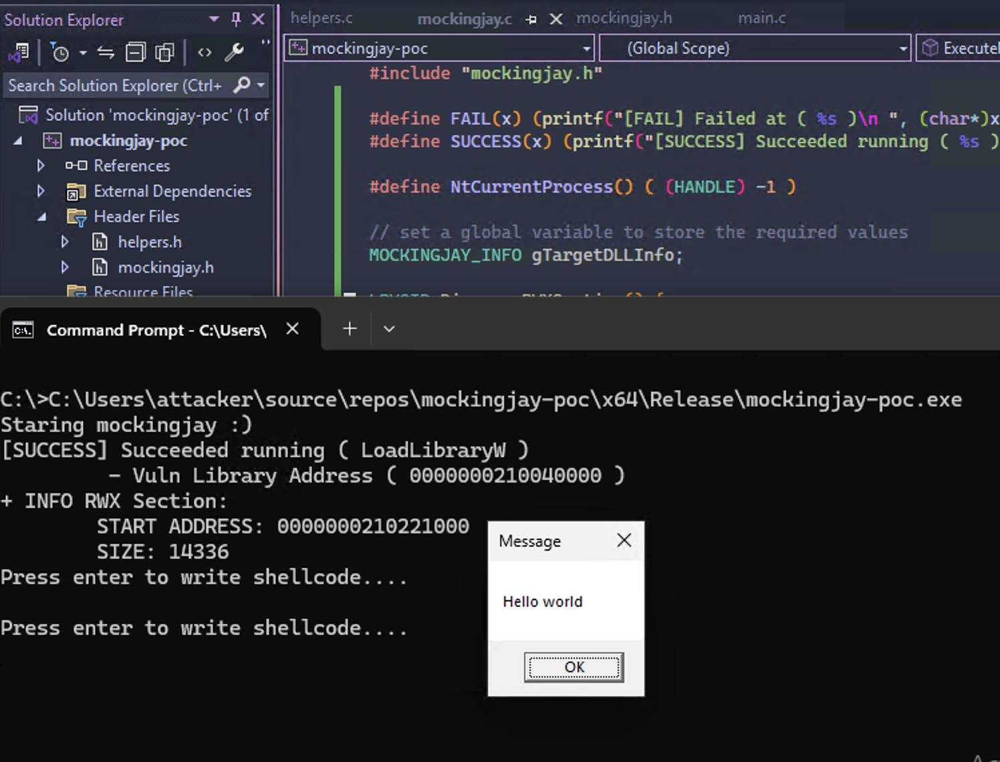

# MockingJay
Shellcode execution by loading a "vulnerable" third-party module containing RWX section.

This technique is well described by SecurityJoes ([Link](https://www.securityjoes.com/post/process-mockingjay-echoing-rwx-in-userland-to-achieve-code-execution))
In essence, the technique uses a vulnerable module loaded into processes such as `ssh.exe` and the `ssh.exe` from Visual Studio which contains a preallocated section `/4` with section protection of RWX.

Since the module has that RWX section already created, the attacker is not required to follow the standard procedures of memory allocation and therefore prevent NTAPIs such as `NtAllocateVirtualMemory` or similar from being executed. As long as the shellcode is small enough to fit within the section, this technique can be levaraged.

This is a small PoC ( for educational purposes only :) ) of self-injection by loading the `msys-2.0.dll` in the current process and writing the shellcode (MessageBox) in the start of the RWX section. Execution is done by function cast.

